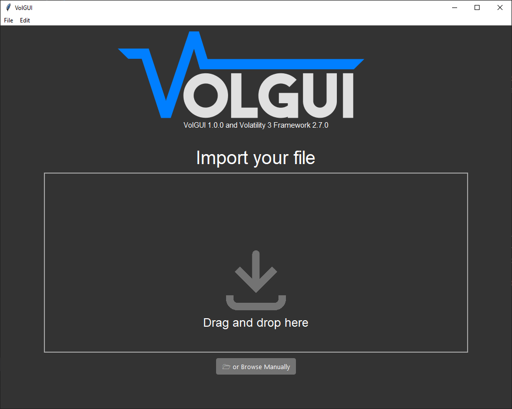
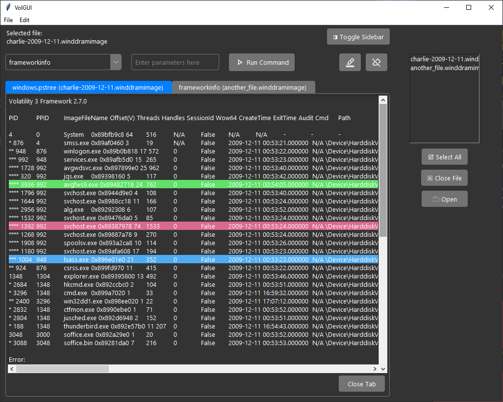
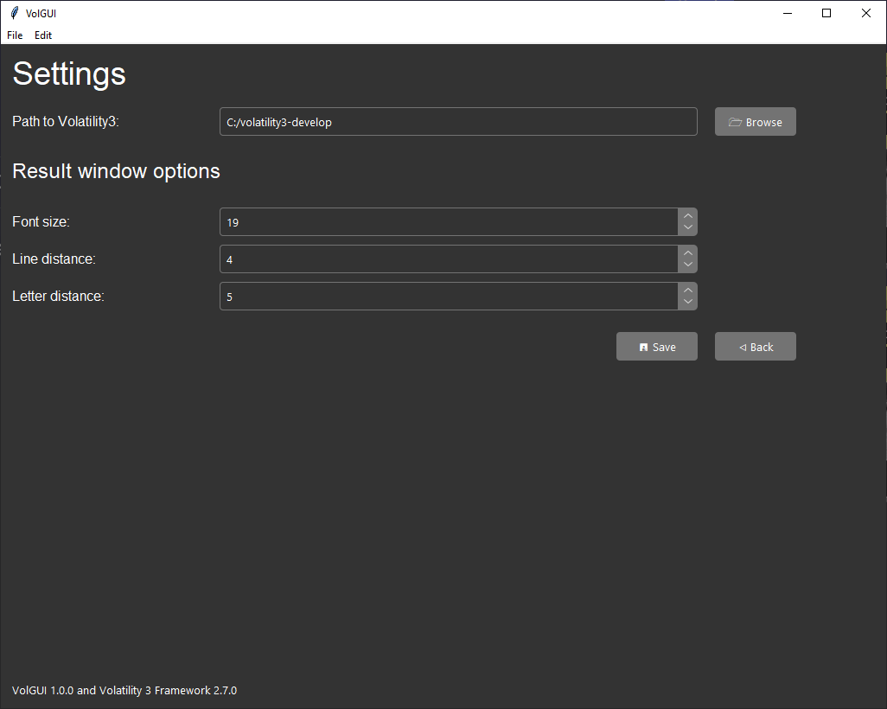
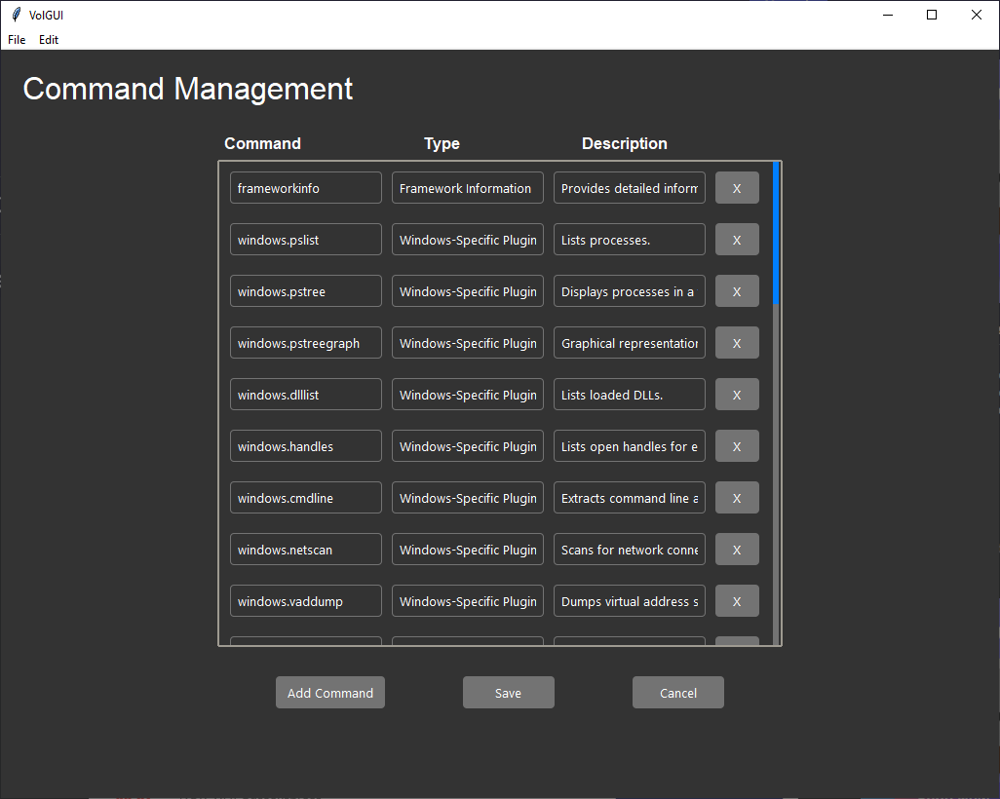
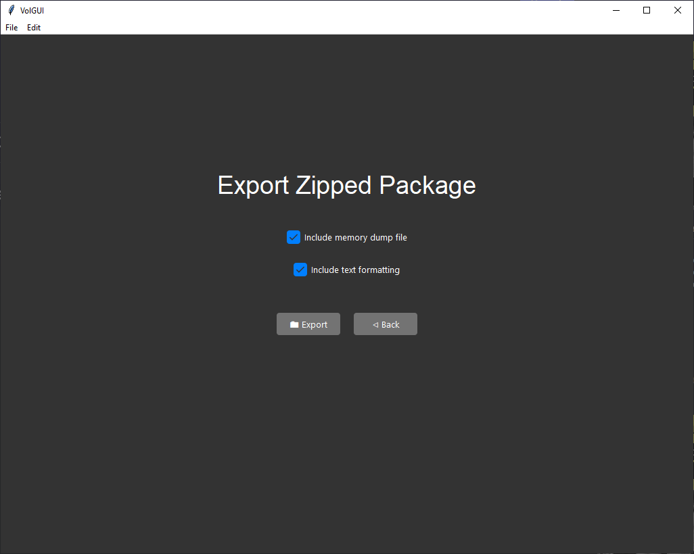

# VolGUI


## Overview

VolGUI is a Python/Tkinter application designed to simplify volatile memory analysis using Volatility3. This tool provides a user-friendly interface, making it accessible for researchers, investigators, and security professionals involved in digital forensics and security analysis.

## Features

### Import Frame

- **Drag and Drop**: Easily import memory dump files by dragging them into the GUI.
- **Browse Functionality**: Alternatively, use a file browser to select memory dump files.


### Workspace Frame

- **Command Execution**: Execute forensic analysis commands with custom command options.
- **Output Management**: Tabbed interface for viewing multiple command outputs, with highlighting capabilities.
- **Tab Functionalities**: Rearrange tabs by dragging and dropping, and close tabs to manage workspace efficiently.
- **Highlighting**: Easily highlight specific sections of the output for better analysis and focus on critical data points.
- **File Selection**: Quickly select and switch between multiple loaded files from the sidebar.
- **Custom Commands**: Add and manage custom commands to tailor the forensic analysis workflow to specific needs.
- **Closing Tabs**: Close unnecessary tabs to keep the workspace organized and focused.

### Settings Frame

- **Customization**: Set font sizes, line spacing, letter spacing, and other output settings to tailor the application to your needs.

### Command Management Frame

- **Command Management**: Add and remove commands to customize the forensic analysis workflow.

### Export Frame

- **Data Exporting**: Compile and export findings into a ZIP file, with options to include or exclude specific types of data.

## Getting Started

### Prerequisites
- Python 3.x
- Tkinter (usually comes with Python installation)
- Additional Python packages: `Pillow`, `tkinterdnd2`

### Installation
1. Clone the repository:
   ```bash
   git clone https://github.com/WesamNakhla/Team-Rhea.git
   ```

2. Navigate to the project directory:
   ```bash
   cd Team-Rhea
   ```

### Running the Application

Execute the main Python script to start the application:
```bash
python main.py
```

## Contributing

Contributions are welcome! Please read our contributing guidelines and submit pull requests to our repository. We appreciate your interest in working with Team Rhea to improve VolGUI.

## License

The license for this project is currently unknown.

## Acknowledgments

Team Rhea: A group of eight students from Høyskolen Kristiania, combining E-Business and Cybersecurity expertise. The team members are:
- Intikhab Alam Khan
- Stephanie Norna Schraml
- Jakob Andar
- Mikael Björkli
- Ummar Amjad
- Mathias Oliver Haslien
- Wesam Nakhla
- Ahmad Taisir Al Aboud

This project started as an Agile school project at Høyskolen Kristiania, as an exam case presented by the company Mnemonic.

Mnemonic: A leading IT security services provider, focusing on digital forensics, managed security services, and security consulting.

Høyskolen Kristiania: A Norwegian university renowned for applied sciences and hands-on learning.

Volatility 3: An open-source framework for memory analysis created by the Volatility Foundation.

## Contact

For more information, please visit our [GitHub repository](https://github.com/WesamNakhla/Team-Rhea).
